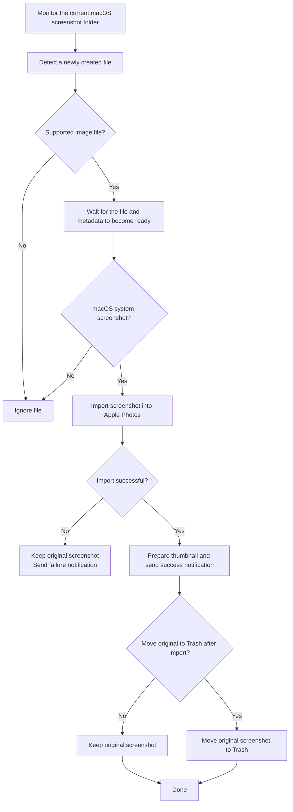

  

<h1 align="center">Shot2Photos</h1>

Automatically import macOS screenshots into Apple Photos.

Shot2Photos is a lightweight native macOS utility that imports system screenshots taken with `⌘⇧3`, `⌘⇧4`, and `⌘⇧5` into Apple Photos. It is particularly useful if you have iCloud Photos enabled.

### Features

- **Automatic screenshot folder detection**  
  Monitors the screenshot location currently configured in macOS. If no custom location is configured, the Desktop is used.

- **System screenshot detection**  
  Newly created images are checked using macOS screenshot metadata, such as `kMDItemIsScreenCapture`. Regular images copied, downloaded, or moved into the same folder are ignored.

- **Automatic Photos import**  
  Confirmed screenshots are automatically imported into the Apple Photos library using PhotoKit.

- **Native notifications with thumbnails**  
  After a successful import, the app sends a native macOS notification containing a thumbnail of the screenshot.

- **Optional source file cleanup**  
  Users can choose whether to keep the original screenshot or automatically move it to the macOS Trash after a successful Photos import. Files are never permanently deleted.

- **Safe failure handling**  
  The original screenshot is always preserved if the Photos import fails. A failure notification may be shown.

- **Duplicate event protection**  
  Filesystem events may be emitted multiple times for the same file. The app prevents a screenshot from being imported more than once during processing.

### Safety

The original screenshot is moved to the Trash only after PhotoKit has explicitly confirmed that the image was successfully imported.

Notification delivery is independent of the import process. If notifications are disabled or a notification cannot be delivered, this does not affect the Photos import or cause the screenshot to be processed again.

## License

Shot2Photos is licensed under the GNU General Public License v3.0 or later.
See [LICENSE](LICENSE).

Copyright (C) 2026 Rui Ma
